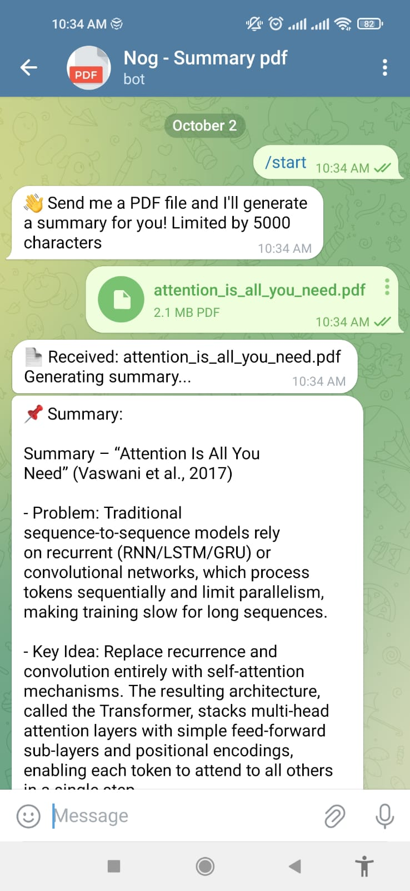
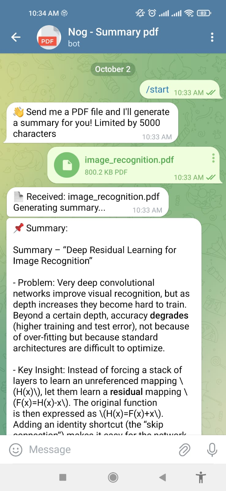

# 📚 AI PDF Summarizer with Groq + Telegram

This project integrates **Groq** (for ultra-fast AI inference) with a **Telegram Bot** to summarize PDF files on demand.  
Users can send a PDF file to the bot, and it will return a concise summary powered by Groq’s LLMs.  

---

## 🚀 Features
- Send any **PDF document** directly in Telegram.  
- The bot extracts and summarizes the text.  
- Powered by **Groq inference** for **fast, low-latency results**.  
- Clear and structured summaries, with optional short or detailed versions.  

---

## 🛠️ Tech Stack
- **Python 3.10+**
- **Groq API** – for AI inference  
- **python-telegram-bot** – Telegram integration  
- **PyPDF2 /** – PDF text extraction  

---

## Usage 

Send a message to @NogSummaryAIBot

PS: If it is not working send me a message: leandronog.santos@gmail.com

if you want it running on your own bot

---

## ⚡ Setup & Installation

1. **Clone this repository**
   ```bash
   git clone git@github.com:leandronogsantos/bot_telegram_summary.git
   cd bot_telegram_summary
   ```
2.  **Create a .env file with your keys**

3.  **Run**
    ```
    python main.py
    ```
## Examples
| Prompt              |  Output                              |
|---------------------|--------------------------------------|
| Attention is all you need |  |
| Image recognition |   |